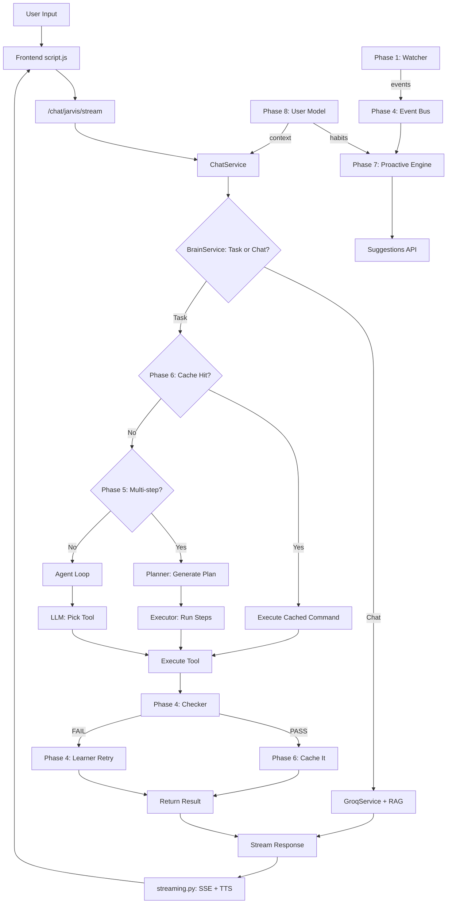

# JARVIS Project — Complete File-by-File Analysis

## 1. Project Overview

JARVIS (Just A Rather Very Intelligent System) is a **full-stack AI assistant** built with:
- **Backend**: Python + FastAPI (async web server)
- **Frontend**: Vanilla HTML/CSS/JS with a WebGL animated orb
- **AI Brain**: Groq LLM (Llama 3.3 70B) + Google Gemini (free tier) + Serper search
- **Voice**: Edge TTS (Microsoft) for speech output, Web Speech API + Whisper for input
- **Vision**: Google Gemini 2.0 Flash for image understanding
- **OS Control**: Windows UI Automation (UIA) + subprocess for app control

The project is organized into **8 progressive "Phases"** of intelligence, each building on the last.

---

## 2. Directory Structure

```
jarvis-2-clean/
├── main.py                  # Entry point — starts uvicorn server
├── config.py                # ALL configuration (env vars, constants)
├── requirements.txt         # Python dependencies
├── .env.example             # Template for API keys
├── app/
│   ├── core/
│   │   ├── startup.py       # Lifespan: starts all 8 phases + services
│   │   ├── state.py         # Global service references (singleton pattern)
│   │   ├── streaming.py     # SSE stream generator + TTS synthesis
│   │   ├── helpers.py       # Rate limit detection helper
│   │   └── middleware.py    # CORS + request logging middleware
│   ├── api/
│   │   ├── chat.py          # /chat/jarvis/stream — main chat endpoint
│   │   ├── dashboard.py     # /dashboard, /api/dashboard/state
│   │   ├── proactive.py     # /api/proactive/* — suggestion management
│   │   ├── system.py        # /health, /api, /api/startup-brief/stream
│   │   ├── tts.py           # /tts, /transcribe
│   │   ├── usermodel.py     # /api/usermodel/knowledge, /forget
│   │   └── testing.py       # /api/test-session/run — batch command testing
│   ├── models/
│   │   └── schemas.py       # Pydantic models (ChatRequest, TTSRequest, etc.)
│   ├── services/
│   │   ├── chat_service.py  # Orchestrates the full chat pipeline
│   │   ├── brain_service.py # Intent classification (task vs chat)
│   │   ├── groq_service.py  # Groq LLM with RAG + multi-key rotation
│   │   ├── realtime_service.py # Alternate Groq service (realtime mode)
│   │   ├── vision_service.py   # Gemini 2.0 Flash vision analysis
│   │   ├── vector_store.py     # ChromaDB embeddings for RAG
│   │   ├── memory_service.py   # Persistent SQLite memory (Phase 2)
│   │   ├── api_key_monitor.py  # Tracks API key health/rate limits
│   │   ├── llm_providers.py    # Multi-provider LLM (Groq + Gemini)
│   │   ├── debug_logger.py     # Structured debug logging
│   │   ├── testing/
│   │   │   └── command_tester.py # Batch command testing harness
│   │   ├── google/
│   │   │   ├── gmail.py       # Gmail API integration
│   │   │   ├── calendar.py    # Google Calendar integration
│   │   │   └── drive.py       # Google Drive integration
│   │   ├── watcher/
│   │   │   └── state_service.py # Background system state daemon (Phase 1)
│   │   └── agent/
│   │       ├── agent_loop.py    # Core agent: LLM → tool call → execute → verify
│   │       ├── tool_registry.py # Tool registration + dispatch
│   │       ├── deps.py          # Dependency injection for tools
│   │       ├── action_sink.py   # Records all actions to JSON log
│   │       ├── tools/           # 50+ tool functions
│   │       │   ├── __init__.py  # load_all_tools()
│   │       │   ├── app_tools.py # Open/close apps, window management
│   │       │   ├── web_tools.py # Search, YouTube, Wikipedia, news
│   │       │   ├── media_tools.py # Music, volume, brightness
│   │       │   ├── settings_tools.py # WiFi, Bluetooth, system status
│   │       │   ├── vision_tools.py  # Screenshot + vision analysis
│   │       │   ├── file_tools.py    # File/folder operations
│   │       │   ├── system_tools.py  # System info, clipboard, timer
│   │       │   └── communication_tools.py # Email, calendar, drive
│   │       ├── automation/
│   │       │   ├── __init__.py
│   │       │   └── uia_engine.py  # Windows UI Automation engine
│   │       ├── checker/
│   │       │   ├── __init__.py    # get_phase4()
│   │       │   ├── coordinator.py # Phase 4 coordinator
│   │       │   ├── checker.py     # Post-action verification (LLM judge)
│   │       │   ├── skill_store.py # Learned skill storage (SQLite)
│   │       │   ├── event_bus.py   # Pub/sub event system
│   │       │   ├── learner.py     # Auto-retry + research on failure
│   │       │   └── vision_verifier.py # Screenshot-based verification
│   │       ├── planner/
│   │       │   ├── __init__.py    # get_phase5()
│   │       │   ├── coordinator.py # Phase 5 coordinator
│   │       │   ├── planner.py     # Multi-step plan generation (LLM)
│   │       │   └── executor.py    # Sequential plan execution
│   │       ├── cache/
│   │       │   ├── __init__.py    # get_phase6()
│   │       │   ├── coordinator.py # Phase 6 coordinator
│   │       │   └── command_cache.py # Verified command shortcut cache
│   │       ├── proactive/
│   │       │   ├── __init__.py    # get_phase7()
│   │       │   ├── proactive_engine.py # Proactive suggestion engine
│   │       │   └── events.py     # State diff → event generation
│   │       └── personalization/
│   │           ├── __init__.py    # get_phase8()
│   │           └── user_model.py  # User facts, aliases, habits
├── web/
│   ├── index.html           # Main chat UI
│   ├── script.js            # Frontend logic (1719 lines)
│   ├── style.css            # Full styling (2740 lines)
│   ├── orb.js               # WebGL animated orb (275 lines)
│   ├── viewer.html          # Image viewer page
│   ├── api-monitor.html     # API key monitor dashboard
│   └── api-monitor.js       # API monitor logic
└── static/
    ├── dashboard.html       # Unified control center
    └── watcher_dashboard.html # Phase 1 watcher dashboard
```

---

## 3. Startup Flow (How JARVIS Boots)

**File**: [main.py](file:///c:/Users/ayush_lr8ru2y/Downloads/jarvis-2-clean-configured/jarvis-2-clean/main.py) → [startup.py](file:///c:/Users/ayush_lr8ru2y/Downloads/jarvis-2-clean-configured/jarvis-2-clean/app/core/startup.py)

```
main.py
  └─ uvicorn.run("main:app")
       └─ app = FastAPI(lifespan=lifespan)
            └─ lifespan() [async context manager]
                 ├─ 1. Start Watcher daemon (Phase 1)
                 ├─ 2. Init Memory store (Phase 2, SQLite)
                 ├─ 3. Load Embedding model (sentence-transformers)
                 ├─ 4. Build Vector index (ChromaDB)
                 ├─ 5. Create LLM services (Groq, Realtime, Brain, Vision)
                 ├─ 6. Configure agent deps + load all tools
                 ├─ 7. Create AgentLoop
                 ├─ 8. Start Phase 4 (Checker + Learner + Skills)
                 ├─ 9. Start Phase 5 (Planner + Executor)
                 ├─ 10. Start Phase 6 (Command Cache)
                 ├─ 11. Start Phase 7 (Proactive Engine)
                 ├─ 12. Start Phase 8 (User Model + Personalization)
                 ├─ 13. Create ChatService (ties everything together)
                 └─ yield (server runs)
                      └─ On shutdown: stop all phases, save sessions
```

Every phase is **fail-soft** — if one fails, JARVIS still works without it.

---

## 4. The 8 Phases of Intelligence

### Phase 1: System State Watcher
**File**: [state_service.py](file:///c:/Users/ayush_lr8ru2y/Downloads/jarvis-2-clean-configured/jarvis-2-clean/app/services/watcher/state_service.py)

- Background daemon thread, refreshes every 2 seconds
- Tracks: running processes, open windows, active window, clipboard, system settings
- Maintains a "launched registry" — remembers which PIDs JARVIS opened
- Enables "close it" / "close notepad" to kill the exact process
- Publishes state-change events to the Phase 4 event bus (Phase 7 integration)
- Uses: `psutil`, `pygetwindow`, `pyperclip`

### Phase 2: Persistent Memory
**File**: [memory_service.py](file:///c:/Users/ayush_lr8ru2y/Downloads/jarvis-2-clean-configured/jarvis-2-clean/app/services/memory_service.py)

- SQLite database for long-term memory
- Stores: user preferences, facts, conversation summaries
- Editable profile files (JSON) for user data
- Fail-soft: if DB fails, JARVIS continues without memory

### Phase 3: Agent Loop + Tool Execution
**Files**: [agent_loop.py](file:///c:/Users/ayush_lr8ru2y/Downloads/jarvis-2-clean-configured/jarvis-2-clean/app/services/agent/agent_loop.py), [tool_registry.py](file:///c:/Users/ayush_lr8ru2y/Downloads/jarvis-2-clean-configured/jarvis-2-clean/app/services/agent/tool_registry.py)

- Core execution engine: LLM decides which tool to call → execute → return result
- Supports multi-turn tool calling (up to 8 iterations)
- 50+ registered tools across 8 categories
- Action sink logs every action to JSON for learning
- Risk classification: safe / risky / dangerous

### Phase 4: Checker + Learner + Skills
**Files**: [checker/](file:///c:/Users/ayush_lr8ru2y/Downloads/jarvis-2-clean-configured/jarvis-2-clean/app/services/agent/checker/)

- **Checker**: After each action, verifies success (LLM judge + optional screenshot)
- **Event Bus**: Pub/sub system for internal events (action_done, state_change, etc.)
- **Skill Store**: SQLite storage of learned action sequences (skills)
- **Learner**: On failure, auto-retries with different approaches; can research online
- **Vision Verifier**: Takes screenshot and asks Gemini "did this action succeed?"

### Phase 5: Planner + Multi-Step Executor
**Files**: [planner/](file:///c:/Users/ayush_lr8ru2y/Downloads/jarvis-2-clean-configured/jarvis-2-clean/app/services/agent/planner/)

- **Planner**: For complex requests, generates a multi-step plan using LLM
- **Executor**: Runs each step sequentially, checking results
- Handles: "open notepad, type hello, save the file" as a 3-step plan
- Falls back to single-step if plan generation fails

### Phase 6: Verified Command Cache
**Files**: [cache/](file:///c:/Users/ayush_lr8ru2y/Downloads/jarvis-2-clean-configured/jarvis-2-clean/app/services/agent/cache/)

- Caches commands that passed Phase 4 verification
- On repeat request: skip LLM planning, execute cached command directly
- Promotes on PASS, evicts on FAIL
- Speeds up repeated commands significantly

### Phase 7: Proactive Engine
**Files**: [proactive/](file:///c:/Users/ayush_lr8ru2y/Downloads/jarvis-2-clean-configured/jarvis-2-clean/app/services/agent/proactive/)

- Watches system state changes (from Phase 1 events)
- Generates suggestions: "You opened VS Code, want me to open your project?"
- Consent system: ask / allow / deny per action type
- Personalized by Phase 8 habits
- Suggest-only by default (PROACTIVE_AUTO_ACT=False)

### Phase 8: User Model + Personalization
**Files**: [personalization/](file:///c:/Users/ayush_lr8ru2y/Downloads/jarvis-2-clean-configured/jarvis-2-clean/app/services/agent/personalization/)

- Learns user facts: "my name is Ayush", "I work at X"
- Aliases: "my project" → specific folder path
- Habits: aggregated from action log (e.g., "opens Spotify at 9am")
- Feeds habits to Phase 7 for personalized suggestions
- Forget API: user can delete any learned data

---

## 5. Chat Flow (How a Message is Processed)

**Entry**: [chat.py](file:///c:/Users/ayush_lr8ru2y/Downloads/jarvis-2-clean-configured/jarvis-2-clean/app/api/chat.py) → [chat_service.py](file:///c:/Users/ayush_lr8ru2y/Downloads/jarvis-2-clean-configured/jarvis-2-clean/app/services/chat_service.py)

```
User sends message via /chat/jarvis/stream
  │
  ├─ 1. ChatService.process_jarvis_stream()
  │     ├─ Load session history
  │     ├─ Brain Service: classify intent (task vs chat)
  │     │
  │     ├─ IF TASK:
  │     │   ├─ Check Phase 6 cache (verified shortcut?)
  │     │   │   └─ HIT: execute cached command → skip to verification
  │     │   ├─ Check Phase 5 planner (multi-step needed?)
  │     │   │   └─ YES: generate plan → execute steps sequentially
  │     │   └─ SINGLE STEP: Agent Loop
  │     │       ├─ LLM picks tool + arguments
  │     │       ├─ Execute tool
  │     │       ├─ Phase 4 Checker verifies result
  │     │       │   ├─ PASS: cache in Phase 6, log skill
  │     │       │   └─ FAIL: Phase 4 Learner retries/researches
  │     │       └─ Return result
  │     │
  │     ├─ IF CHAT:
  │     │   ├─ RAG: search vector store for context
  │     │   ├─ Groq LLM generates response (with history)
  │     │   └─ Stream response chunks
  │     │
  │     └─ Stream response via SSE
  │
  ├─ 2. streaming.py: stream_generator()
  │     ├─ Split text into sentences
  │     ├─ For each sentence: synthesize TTS audio (Edge TTS)
  │     ├─ Check TTS cache (SSD) first
  │     ├─ Embed base64 audio in SSE events
  │     └─ Send: {chunk, audio, activity, search_results, actions}
  │
  └─ 3. Frontend (script.js)
        ├─ Parse SSE events
        ├─ Display text chunks in chat bubble
        ├─ Play audio via TTSPlayer queue
        ├─ Show activity panel events
        ├─ Show search results widget
        └─ Animate orb (active/speaking states)
```

---

## 6. Key Services (Detailed)

### ChatService
**File**: [chat_service.py](file:///c:/Users/ayush_lr8ru2y/Downloads/jarvis-2-clean-configured/jarvis-2-clean/app/services/chat_service.py)

- Central orchestrator — ties together all services
- Manages sessions (create, load, save to disk)
- Routes: jarvis stream, general chat, realtime, startup brief
- Handles: image attachments (vision), search results, action feedback

### BrainService
**File**: [brain_service.py](file:///c:/Users/ayush_lr8ru2y/Downloads/jarvis-2-clean-configured/jarvis-2-clean/app/services/brain_service.py)

- Intent classifier: "Is this a task or casual chat?"
- Uses Groq LLM with a classification prompt
- Returns: `task` or `chat` with confidence score
- Fast path: keyword matching for obvious cases

### GroqService
**File**: [groq_service.py](file:///c:/Users/ayush_lr8ru2y/Downloads/jarvis-2-clean-configured/jarvis-2-clean/app/services/groq_service.py)

- Multi-key rotation (round-robin across GROQ_API_KEYS)
- RAG integration: searches vector store, injects context
- Streaming + non-streaming modes
- Rate limit handling: auto-switches to next key on 429

### VisionService
**File**: [vision_service.py](file:///c:/Users/ayush_lr8ru2y/Downloads/jarvis-2-clean-configured/jarvis-2-clean/app/services/vision_service.py)

- Google Gemini 2.0 Flash (free tier)
- Accepts: base64 images, screenshots, camera captures
- Returns: natural language description of what's in the image
- Used for: vision chat, action verification (Phase 4)

### LLM Providers
**File**: [llm_providers.py](file:///c:/Users/ayush_lr8ru2y/Downloads/jarvis-2-clean-configured/jarvis-2-clean/app/services/llm_providers.py)

- Abstraction layer over multiple LLM backends
- Groq (primary) + Gemini (fallback/free tier)
- Automatic failover: if Groq is rate-limited, try Gemini
- Configurable via environment variables

---

## 7. Agent Tools (50+ Tools)

### App Tools ([app_tools.py](file:///c:/Users/ayush_lr8ru2y/Downloads/jarvis-2-clean-configured/jarvis-2-clean/app/services/agent/tools/app_tools.py))
- `open_application(name)` — launches any app by name
- `close_application(name)` — kills app (uses Phase 1 launched registry)
- `minimize_window`, `maximize_window`, `restore_window`
- `switch_window(title)` — bring window to foreground
- `list_open_windows()` — show all visible windows

### Web Tools ([web_tools.py](file:///c:/Users/ayush_lr8ru2y/Downloads/jarvis-2-clean-configured/jarvis-2-clean/app/services/agent/tools/web_tools.py))
- `search_web(query)` — Serper API (Google search)
- `search_youtube(query)` — opens YouTube search
- `search_wikipedia(query)` — Wikipedia API summary
- `get_news(topic)` — news search via Serper
- `open_website(url)` — opens URL in browser

### Media Tools ([media_tools.py](file:///c:/Users/ayush_lr8ru2y/Downloads/jarvis-2-clean-configured/jarvis-2-clean/app/services/agent/tools/media_tools.py))
- `play_music(query)` — YouTube music via browser
- `set_volume(level)` — system volume (0-100)
- `set_brightness(level)` — screen brightness
- `mute_unmute()` — toggle system mute

### Settings Tools ([settings_tools.py](file:///c:/Users/ayush_lr8ru2y/Downloads/jarvis-2-clean-configured/jarvis-2-clean/app/services/agent/tools/settings_tools.py))
- `toggle_wifi()` — enable/disable WiFi
- `toggle_bluetooth()` — enable/disable Bluetooth
- `read_system_status()` — volume, brightness, wifi, bluetooth state
- Uses: `netsh`, `powershell`, Windows COM (WMI)

### Vision Tools ([vision_tools.py](file:///c:/Users/ayush_lr8ru2y/Downloads/jarvis-2-clean-configured/jarvis-2-clean/app/services/agent/tools/vision_tools.py))
- `take_screenshot()` — captures screen, returns base64
- `analyze_screen(question)` — screenshot + Gemini vision
- `analyze_image(base64, question)` — analyze any image

### File Tools ([file_tools.py](file:///c:/Users/ayush_lr8ru2y/Downloads/jarvis-2-clean-configured/jarvis-2-clean/app/services/agent/tools/file_tools.py))
- `create_file(path, content)`, `read_file(path)`, `write_file(path, content)`
- `create_folder(path)`, `list_folder(path)`
- `delete_file(path)`, `copy_file(src, dst)`, `move_file(src, dst)`
- `search_files(pattern, directory)`

### System Tools ([system_tools.py](file:///c:/Users/ayush_lr8ru2y/Downloads/jarvis-2-clean-configured/jarvis-2-clean/app/services/agent/tools/system_tools.py))
- `get_system_info()` — CPU, RAM, disk, OS info
- `get_clipboard()` / `set_clipboard(text)`
- `set_timer(seconds, label)` — background timer with notification
- `run_command(cmd)` — execute shell command (risky)

### Communication Tools ([communication_tools.py](file:///c:/Users/ayush_lr8ru2y/Downloads/jarvis-2-clean-configured/jarvis-2-clean/app/services/agent/tools/communication_tools.py))
- `send_email(to, subject, body)` — Gmail API
- `check_inbox(count)` — read recent emails
- `get_calendar_events(days)` — upcoming events
- `create_calendar_event(...)` — add event
- `search_drive(query)` — Google Drive search

---

## 8. UIA Engine (Windows UI Automation)

**File**: [uia_engine.py](file:///c:/Users/ayush_lr8ru2y/Downloads/jarvis-2-clean-configured/jarvis-2-clean/app/services/agent/automation/uia_engine.py)

- Uses `comtypes` + `uiautomation` library for Windows UI control
- Can: click buttons, type text, read controls, navigate menus
- Finds UI elements by: name, automation ID, class, control type
- Used by Phase 5 executor for GUI automation steps
- Example: "Click the Save button in Notepad" → finds Save button → clicks it

---

## 9. Frontend Architecture

### index.html
- Single-page app with glassmorphism design
- Components: header, chat area, input bar, activity panel, search widget, settings, camera panel
- Loads: Poppins font, style.css, orb.js, script.js

### orb.js (WebGL Orb)
- Animated 3D orb rendered with WebGL shaders
- Simplex noise for organic wobble effect
- Purple-cyan color palette with hue rotation
- States: idle (dim), active (bright + rotating), speaking (pulsing)
- Responds to: hover, AI processing, TTS playback

### script.js (1719 lines)
- **SSE Client**: Connects to /chat/jarvis/stream, parses events
- **TTS Player**: Queue-based audio playback from base64 chunks
- **Push-to-Talk**: Ctrl+Shift hold → MediaRecorder + Web Speech API
- **Camera**: getUserMedia → capture → send as vision attachment
- **Activity Panel**: Shows real-time flow (tool calls, cache hits, verification)
- **Search Widget**: Displays web search results inline
- **Settings**: Auto-open panels, thinking sounds, TTS toggle
- **Pre-Starter**: Plays "One moment please" while AI processes

### style.css (2740 lines)
- Dark theme with glassmorphism (backdrop-filter blur)
- CSS variables for theming
- Responsive: mobile + desktop
- Animations: message entrance, orb pulse, status dot
- Components: glass panels, chips, toggles, toasts, camera panel

---

## 10. API Endpoints Summary

| Endpoint | Method | Purpose |
|----------|--------|---------|
| `/chat/jarvis/stream` | POST | Main chat (SSE stream with TTS) |
| `/chat` | POST | General chat (non-streaming) |
| `/chat/stream` | POST | General chat (streaming) |
| `/chat/realtime` | POST | Realtime mode (non-streaming) |
| `/chat/realtime/stream` | POST | Realtime mode (streaming) |
| `/chat/history/{session_id}` | GET | Get chat history |
| `/tts` | POST | Text-to-speech (returns MP3) |
| `/transcribe` | POST | Audio → text (Whisper) |
| `/health` | GET | System health check |
| `/api` | GET | API info + endpoint list |
| `/api/dashboard/state` | GET | Full system state (all phases) |
| `/api/watcher/state` | GET | Phase 1 watcher snapshot |
| `/api/proactive/pending` | GET | Pending suggestions |
| `/api/proactive/accept` | POST | Accept a suggestion |
| `/api/proactive/dismiss` | POST | Dismiss a suggestion |
| `/api/proactive/consent` | POST | Set consent mode |
| `/api/usermodel/knowledge` | GET | What JARVIS knows about user |
| `/api/usermodel/forget` | POST | Delete learned data |
| `/api/test-session/run` | POST | Batch command testing |
| `/api/test-session/{id}/logs` | GET | Download test logs |
| `/api/startup-brief/stream` | GET | Daily greeting (SSE + TTS) |
| `/api/key-monitor` | GET | API key health |
| `/dashboard` | GET | Control Center HTML |
| `/watcher` | GET | Watcher dashboard HTML |
| `/jarvis/` | GET | Main frontend |

---

## 11. Configuration ([config.py](file:///c:/Users/ayush_lr8ru2y/Downloads/jarvis-2-clean-configured/jarvis-2-clean/config.py))

Key settings loaded from `.env`:
- `GROQ_API_KEYS` — comma-separated list of Groq API keys (rotation)
- `GEMINI_API_KEY` — Google Gemini (free tier, for vision)
- `SERPER_API_KEY` — Google Search API
- `GROQ_MODEL` — default: `llama-3.3-70b-versatile`
- `TTS_VOICE` — Edge TTS voice (default: `en-IN-PrabhatNeural`)
- `ASSISTANT_NAME` — "JARVIS"
- Phase toggles: `PHASE4_ENABLED`, `PHASE5_ENABLED`, `PHASE6_ENABLED`, `PHASE7_ENABLED`, `PHASE8_ENABLED`
- `PROACTIVE_AUTO_ACT` — whether Phase 7 can act without asking
- `SKILL_MIN_REPEATS` — how many times before a skill is "learned"

---

## 12. Data Flow Diagram



---

## 13. Key Design Patterns

1. **Fail-Soft Everything**: Every phase wraps in try/except. If it fails, JARVIS degrades gracefully.
2. **Singleton + Lazy Init**: `get_phase4()`, `get_watcher()`, etc. create on first call.
3. **Multi-Key Rotation**: Groq keys rotate round-robin; on 429, skip to next.
4. **SSE Streaming**: All responses stream as Server-Sent Events with inline TTS audio.
5. **TTS Caching**: Audio synthesized once, cached on SSD (SHA256 hash → .mp3 file).
6. **Event-Driven**: Phase 4 event bus decouples watcher, checker, proactive engine.
7. **Consent-First**: Proactive actions require user consent (ask/allow/deny).
8. **Privacy-Aware**: Clipboard never logged, memory is local SQLite, no cloud storage.

---

## 14. Dependencies (requirements.txt)

Core: `fastapi`, `uvicorn`, `groq`, `google-generativeai`, `chromadb`, `sentence-transformers`
OS Control: `psutil`, `pygetwindow`, `pyperclip`, `comtypes`, `uiautomation`
Voice: `edge-tts`
Google: `google-api-python-client`, `google-auth`
Web: `httpx`, `aiofiles`
Search: `serper` (via httpx)

---

## 15. Current State Assessment

### What Works Well
- Clean 8-phase architecture with clear separation
- Robust error handling (fail-soft everywhere)
- Multi-key LLM rotation for reliability
- TTS caching eliminates repeated synthesis
- Event-driven proactive suggestions
- Comprehensive tool set (50+ tools)
- Beautiful frontend with WebGL orb

### Areas for Improvement
- **No unit tests** — no test files found in the project
- **Frontend is monolithic** — script.js is 1719 lines, no modules
- **No authentication** — API is open (localhost only, but still)
- **Limited error recovery** in multi-step plans (Phase 5)
- **No conversation branching** — linear history only
- **Memory search is basic** — no semantic search over memories
- **No plugin system** — tools are hardcoded in Python files
- **Windows-only** — UIA, netsh, powershell are Windows-specific
